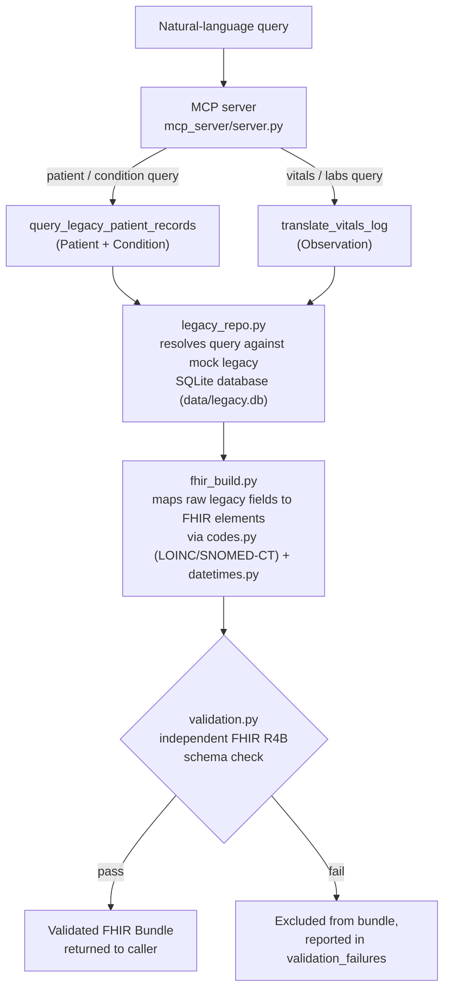

# Legacy-to-FHIR Mapping MCP Server

A Model Context Protocol (MCP) server that sits on top of a mock legacy
healthcare database and exposes read-only tools that map fragmented,
inconsistently-formatted records into valid, schema-conformant FHIR
resources (`Patient`, `Observation`, `Condition`) — queryable by an AI agent
using natural language instead of hand-written SQL.

Mock/synthetic data only — no real PHI. Read-only by design, no write path.

## Overview

Legacy healthcare systems store patient data in fragmented, non-standardized
formats that predate modern interoperability standards like FHIR. Hospitals
and payers still run production systems on these decades-old schemas, and
migrating them wholesale is slow, expensive, and high-risk — which is why
healthcare interoperability/translation layers exist commercially as a
practical middle ground: leave the legacy system in place, expose it
through a standards-conformant interface instead of a full rewrite. Every AI agent or
modern tool that wants to *use* this data safely needs exactly that kind of
translation layer in front of it — natural-language querying without one
means an LLM either can't reach the data at all, or reaches it by writing
raw SQL against an undocumented, inconsistent schema, with no guarantee the
result is even valid healthcare data.

This project builds a working (if intentionally small-scale) version of
that translation layer end-to-end: a synthetic legacy database with
realistic messiness (inconsistent date formats, demographic data split
across unlinked tables, units embedded in free-text values, un-coded
diagnosis notes), and an MCP server that maps it cleanly into FHIR —
never silently guessing when a mapping is ambiguous, and never returning
a resource that hasn't independently passed schema validation.

## Features

- Natural-language patient/vitals lookup over a mock legacy database
- Maps fragmented legacy records into valid FHIR `Patient`, `Observation`,
  and `Condition` resources
- LOINC/SNOMED-CT code mapping, verified against a live FHIR terminology
  server rather than trusted at face value (`mapping/fhir-mapping-schema.md`)
- Independent FHIR R4B schema validation gate on every returned resource —
  nothing reaches the caller without passing this check
- Read-only by design — the SQLite connection is opened in `mode=ro`, so no
  write path exists even at the driver level
- Deliberate fallback-over-guessing behavior for every ambiguous mapping
  case (missing units, unmapped codes, ambiguous patient joins) — flagged
  and reported, never inferred

## Architecture



The mock legacy data itself comes from [Synthea](https://github.com/synthetichealth/synthea)
(MITRE's open-source synthetic patient generator), then deliberately degraded
by `legacy_data/mangle.py` into a fragmented, legacy-system-shaped schema —
see [Legacy data design](#legacy-data-design) below.

## Technical specification

### Schema validation

Every FHIR resource this server returns is a **pydantic model, not a plain
dict** — `fhir.resources` (the FHIR model library used here) is built on
[`fhir_core`](https://pypi.org/project/fhir-core/), which is itself built on
[pydantic](https://docs.pydantic.dev/) v2. Concretely:

```python
>>> from fhir.resources.R4B.patient import Patient
>>> import pydantic
>>> issubclass(Patient, pydantic.BaseModel)
True
```

`mcp_server/validation.py` instantiates the matching pydantic model
(`Patient`, `Observation`, or `Condition`) for every resource `fhir_build.py`
produces, **as an independent step that doesn't trust the mapping code that
built the resource**. Pydantic's own validation raises on missing required
fields, wrong types, or malformed structure — the exact same enforcement
mechanism a hand-written Zod schema would provide in a TypeScript service,
applied here to the FHIR R4B spec. A resource that fails is excluded from
the bundle and reported in `validation_failures`; there is no code path
that returns a resource without going through this check.

### Security boundaries

| Boundary | How it's enforced |
|---|---|
| Read-only data access | The SQLite connection is opened in `mode=ro` (`legacy_repo.py`) — no write path exists even at the driver level, independent of any application-level checks |
| No secrets / API keys | Nothing in the codebase reads `os.environ` or any credential store; no external service is called at runtime (see [Configuration](#configuration)) |
| No real PHI | All patient data is synthetic, generated by Synthea — every SSN carries Synthea's `999-`-prefix synthetic-data marker, and no real patient data is ingested anywhere in the pipeline |
| Local-only execution | The MCP server communicates over stdio only; it does not open a network port or accept remote connections |
| Untrusted-input handling | Every ambiguous or unparseable legacy value is flagged and excluded rather than guessed — see [Validation & fallback philosophy](#validation--fallback-philosophy) |

## Prerequisites

- Python 3.10+
- A JDK (11+) only if you intend to regenerate the mock database from
  scratch — not needed to run the server against the checked-in
  `data/legacy.db`

## Installation

Three steps — clone, install, verify. Dependency versions are pinned
(`pyproject.toml`) to a combination that's actually tested working; an
unpinned `fhir.resources` install can pull in an incompatible
`annotated-types` release and fail with an `ImportError`, so match these
versions rather than installing latest:

```bash
# 1. Clone
git clone https://github.com/gdanse/legacy-to-fhir-mcp-server.git
cd legacy-to-fhir-mcp-server

# 2. Install (pinned versions -- see pyproject.toml)
python3 -m venv .venv && source .venv/bin/activate
pip install "mcp==1.28.1" "fhir.resources==8.3.0" "annotated-types<0.8.0"

# 3. Verify
python3 scripts/test_query_legacy_patient_records.py
```

All three steps together run in well under two minutes on a normal
connection — the mock database (`data/legacy.db`) is already checked in,
so there's no seeding step.

## Usage

Start the server (stdio transport):

```bash
python3 mcp_server/server.py
```

Claude Code isn't required — the server speaks the standard Model Context
Protocol over stdio, so anything that can act as an MCP client can use it.
A few ways to actually make queries:

### Via Claude Code (or any MCP client)

Copy `.mcp.json.example` to `.mcp.json` and replace `<path-to-this-repo>`
with your local checkout path (`.mcp.json` is gitignored since that path is
machine-specific):

```bash
cp .mcp.json.example .mcp.json
```

Then ask natural-language questions — the model picks the right tool
automatically:

| Example query | Tool selected | Returns |
|---|---|---|
| `"What conditions does Ben Torp have?"` | `query_legacy_patient_records` | `Patient` + `Condition` resources |
| `"Adelle Raynor's weight"` | `translate_vitals_log` | `Observation` resources, filtered to weight readings |
| `"MRN720072 heart rate"` | `translate_vitals_log` | `Observation` resources, resolved by MRN and filtered to heart rate |

Both tools accept a name, a legacy MRN, or both, and return:

```json
{
  "bundle": "<FHIR searchset Bundle>",
  "warnings": ["<flags for anything left deliberately unresolved>"],
  "validation_failures": ["<resources excluded for failing schema validation>"]
}
```

Any other MCP client works the same way — e.g. the standalone
[MCP Inspector](https://github.com/modelcontextprotocol/inspector), a
browser-based dev tool for exercising an MCP server without wiring it into
an AI assistant at all:

```bash
npx @modelcontextprotocol/inspector python3 mcp_server/server.py
```

### Without any MCP client — direct Python calls

Natural-language tool *selection* is what an MCP client provides. The data
retrieval, FHIR mapping, and validation underneath don't depend on it — the
tool functions are plain Python and can be called directly with a query
string, no AI involved:

```python
from mcp_server.server import query_legacy_patient_records, translate_vitals_log

query_legacy_patient_records("Ben Torp")
translate_vitals_log("Adelle Raynor's weight")
```

This is exactly what the smoke tests in `scripts/` do — see
[Testing](#testing) below.

## Configuration

None needed. This project requires no API keys or secrets — all data is
local, synthetic, and self-contained (`data/legacy.db`), and no code path
calls any external service at runtime.

## Testing

Smoke tests bypass the MCP transport, call the tool functions directly, and
validate every returned resource against `fhir.resources`' FHIR R4B models:

```bash
python3 scripts/test_query_legacy_patient_records.py
python3 scripts/test_translate_vitals_log.py
python3 scripts/test_validation_layer.py
```

`scripts/verify_legacy_mess.py` prints direct SQL evidence of each legacy
mess pattern described below, straight from `data/legacy.db`.

## Project structure

```
mcp_server/          MCP server + FHIR mapping/validation logic
  server.py            tool entry points
  legacy_repo.py       resolves natural-language queries against the DB
  fhir_build.py        maps legacy rows -> FHIR resource dicts
  codes.py             LOINC / SNOMED-CT lookup tables
  datetimes.py         legacy date-format parsing
  validation.py        independent FHIR R4B schema validation gate
legacy_data/          builds the mock legacy database from Synthea output
  extract.py            reads clean FHIR bundles
  mangle.py             deliberately degrades them into legacy-shaped rows
  schema.py             SQLite schema for the four legacy tables
mapping/
  fhir-mapping-schema.md  field-by-field mapping spec + verified code tables
scripts/               smoke tests + database build/verification scripts
data/legacy.db         the mock legacy database (checked in, regeneratable)
```

## Legacy data design

`data/legacy.db` is generated from Synthea's clean, FHIR-conformant output,
then deliberately degraded into four legacy-system-shaped SQLite tables:

| Table | Legacy mess pattern |
|---|---|
| `patient_identity` | DOB as `MM/DD/YYYY` string |
| `patient_contact` | Same patient's *other* half of the demographic record, in a separate table with no shared key — joins to `patient_identity` only by fuzzy name+DOB match. DOB stored as a Unix epoch here (a different format than `patient_identity`). |
| `vitals_log` | Date as bare `YYYYMMDD` string. Units are frequently `NULL`, and sometimes ride along inside `value_raw` instead (e.g. `"55.8 kg"`) rather than in a `unit` column. |
| `conditions_log` | Date as `DD-Mon-YYYY` string. Conditions are stored as denormalized free text (e.g. `"high blood pressure, on meds"`) instead of a coded value, and same-day conditions are sometimes merged into one comma-separated note. |

To regenerate from scratch:

```bash
# 1. Requires a JDK (11+) on PATH.
git clone --depth 1 https://github.com/synthetichealth/synthea.git
cd synthea
./run_synthea -p 40   # generates ~40 synthetic patients into output/fhir/

# 2. Copy the bundles into this project
cp -R output/fhir "<this-repo>/synthea_output/fhir"

# 3. Build the mangled legacy SQLite DB
cd "<this-repo>"
python3 scripts/build_legacy_db.py
```

## Validation & fallback philosophy

Every resource returned by either tool passes through `mcp_server/validation.py`
— an independent FHIR R4B schema check that doesn't trust the mapping logic
in `fhir_build.py`. Anything that fails is excluded from the bundle and
reported in a sibling `validation_failures` list instead of being returned
as if it were valid.

The same never-guess principle governs every ambiguous mapping case:

| Flag | Resource | Trigger |
|---|---|---|
| `identity_join_unresolved` | Patient | Zero or multiple name+DOB matches across the split identity/contact tables |
| `loinc_code_unresolved` | Observation | `vital_label` not found in the LOINC lookup table |
| `unit_missing` | Observation | `unit` column is `NULL` (and no unit was embedded in the raw value) |
| `condition_code_unresolved` | Condition | `note_text` not found in the SNOMED-CT lookup table, or is multi-concept free text |

See `mapping/fhir-mapping-schema.md` for the full field-by-field mapping
spec, including the verified LOINC/SNOMED-CT lookup tables and the
corrections made when initial code guesses turned out to be wrong.

## License

MIT — see [LICENSE](LICENSE).
